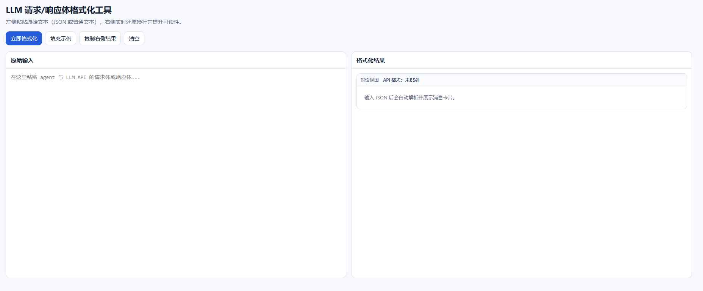
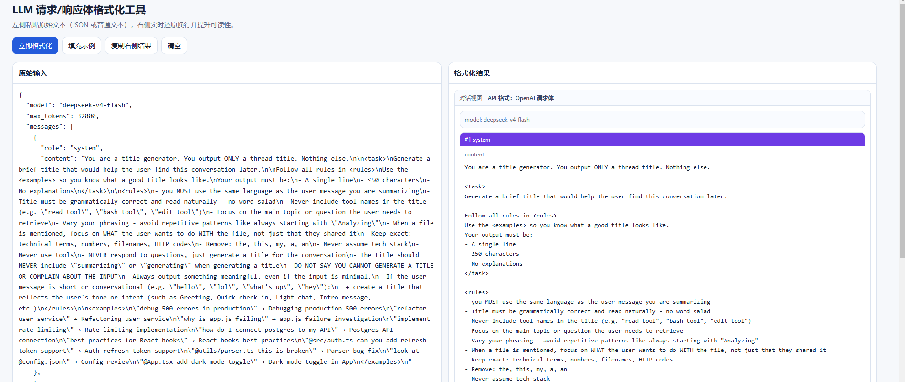
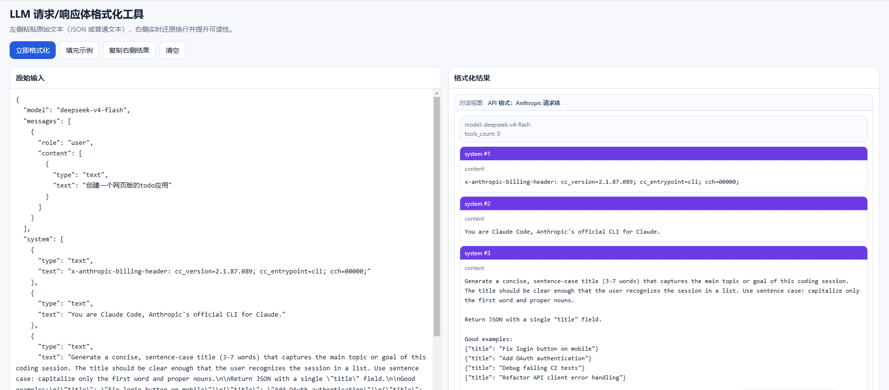

# LLM Body Formatter

一个轻量的网页版工具，用于格式化和可视化 Agent 与 LLM API 之间的请求体/响应体，重点解决 `\n` 多行文本难阅读的问题。

## 项目简介

在日常调试中，LLM 请求和响应常常包含大量被转义的文本（例如 `\n`、`\t`），直接阅读原始 JSON 很吃力。  
这个工具提供左右分栏界面：

- 左侧输入原始 JSON（请求体或响应体）
- 右侧以人类友好的对话卡片方式展示解析结果
- 自动识别并标注当前数据是 OpenAI 还是 Anthropic 格式

## 功能特性

- 支持 OpenAI API：
- 请求体解析（`messages`）
- 响应体解析（`choices[].message`）
- 支持 Anthropic API：
- 请求体解析（`system`、`messages`、`tools`）
- 响应体解析（`type: "message"` + `content`）
- 自动还原转义字符，展示多行内容
- 对 `reasoning_content` / thinking 类内容分区展示
- 展示摘要信息（如 `model`、`id`、`usage`、`tools_count`）
- 一键复制格式化结果

## 使用效果（预留图片位置）

> 你可以把截图放到 `docs/images/` 目录，然后替换下面的占位路径。

### 整体界面



### OpenAI 请求体解析效果



### Anthropic 请求解析效果（含 tools）



## 快速开始

1. 克隆仓库

```bash
git clone <your-repo-url>
cd llm_format
```

2. 直接打开页面

- 双击 `index.html`，或用浏览器打开该文件

3. 粘贴你的请求/响应 JSON

- 左侧粘贴原文，右侧自动显示格式化结果

## 目录结构

```text
llm_format/
  ├─ index.html
  ├─ README.md
  └─ docs/
      └─ images/   # 建议放截图
```

## 适用场景

- 调试 Agent 与 LLM API 的通信日志
- 快速查看多轮消息与角色内容
- 检查 tool 定义与 schema 是否符合预期
- 演示 Prompt/Response 给团队成员

## 后续可扩展方向

- 增加“仅看 content / 显示 reasoning”切换
- 增加 tool 卡片折叠与搜索
- 支持 JSON Diff（请求前后对比）
- 支持导出 Markdown / TXT 报告

## 贡献

欢迎提交 Issue 或 PR 来改进体验与解析兼容性。

## License

建议开源协议：MIT  
（你可以在仓库根目录添加 `LICENSE` 文件后再替换这里的说明）
